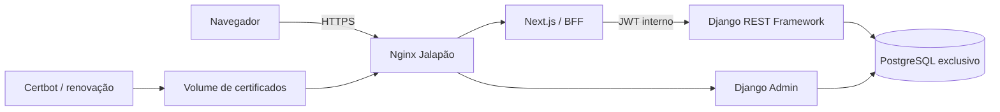
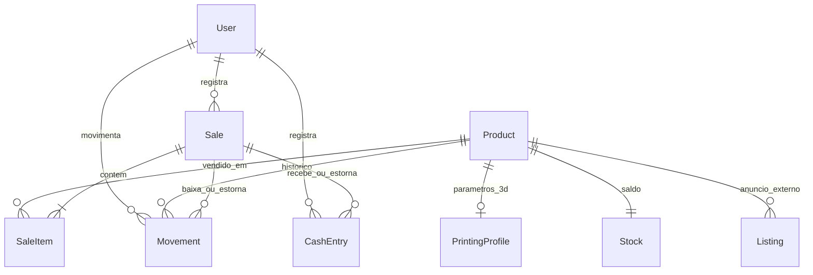

# Arquitetura e modelo de dados

O Traefik compartilhado permanece responsável pelo HTTP. O Nginx da Jalapão termina
HTTPS na porta443 e roteia somente a aplicação, o Admin, a API e os manuais autorizados.
Banco e API não publicam portas no host. Código/segredos/dados têm ciclos separados.

As entidades comerciais usam UUID; os usuários mantêm PK padrão Django. IDs externos
permanecem em campos próprios. FKs de histórico usam PROTECT; perfis 3D são dependentes
do produto. A quantidade atual é uma projeção mantida junto do razão de movimentos.
OutboxEvent recebe intenção de sincronização na mesma transação; ainda não há worker externo.

Apps não são microsserviços: uma transação PostgreSQL mantém a consistência entre venda,
estoque e caixa. Cálculo puro em domain.py; casos de uso em services.py; serialização e
permissões em api.py. ORM e migrations seguem convenções Django, sem repositórios artificiais.

## Valores gerenciais
| Indicador | Regra |
|---|---|
| Estoque em reais | Saldo de cada produto × custo atual |
| Faturamento | Bruto das vendas confirmadas, inclusive ainda não recebidas |
| Líquido da venda | Bruto − desconto − taxas − frete pago pela loja |
| Lucro estimado | Líquido − custo dos itens congelado na venda |
| A receber | Líquido das vendas confirmadas não recebidas |
| Caixa | Entradas efetivas − saídas efetivas, incluindo estornos |

Fluxo de caixa manual não altera automaticamente lucro de vendas. Compra/produção de
estoque é registrada como movimento e, se houve desembolso, como saída de caixa separada.
O operador informa taxas efetivas; calculadoras antigas continuam sendo simulações.
