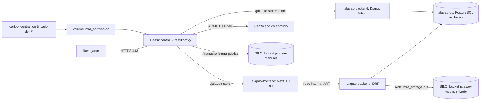
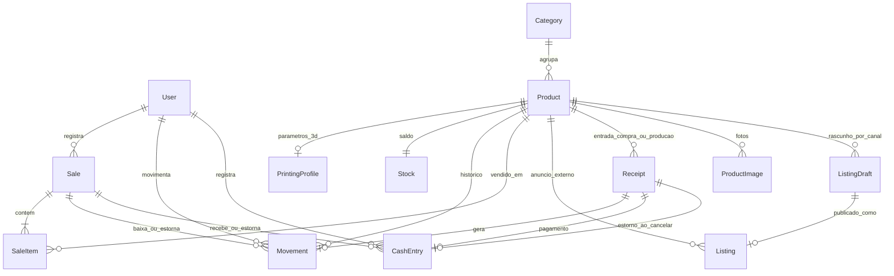

# Arquitetura e modelo de dados


```mermaid
flowchart LR
  Browser[Navegador] -->|HTTPS 443| Traefik[Traefik central - traefikproxy]
  Traefik -->|/jalapao-store| Next[jalapao-frontend: Next.js + BFF]
  Traefik -->|/jalapao-store/admin/| Admin[jalapao-backend: Django Admin]
  Next -->|rede interna, JWT| API[jalapao-backend: DRF]
  API --> DB[(jalapao-db: PostgreSQL exclusivo)]
  Admin --> DB
  Traefik -->|ACME HTTP-01| DomainCert[Certificado do domínio]
  Certbot[certbot central: certificado do IP] --> Certs[volume infra_certificates]
  Certs --> Traefik
  Traefik -->|/manuais/ leitura pública| Manuais[(SILO: bucket jalapao-manuais)]
  API -->|rede infra_storage, S3| Fotos[(SILO: bucket jalapao-media, privado)]
```

Um único proxy na VPS (spec 019): o Traefik central do repositório `traefikproxy` atende as
portas públicas 80 e 443, termina o HTTPS e roteia pelos labels que cada sistema declara no
seu compose. Da loja, só o front e o Django Admin têm rota; a API é consumida pelo BFF do
Next na rede interna do Docker. O certificado do domínio é emitido pelo Traefik; o do IP,
pelo certbot da mesma stack central. Banco e API não publicam portas no host. Código,
segredos e dados têm ciclos separados.

Os arquivos ficam no SILO, o servidor de arquivos S3 da mesma stack central (spec 020): as
fotos num bucket privado, que só o Django lê e devolve depois do login; os manuais num bucket
de leitura pública, roteado pelo Traefik em `/manuais/`. Sem servidor S3 configurado
(desenvolvimento e testes), as fotos ficam no disco.


```mermaid
erDiagram
  User ||--o{ Sale : registra
  User ||--o{ Movement : movimenta
  User ||--o{ CashEntry : registra
  Category ||--o{ Product : agrupa
  Product ||--o| PrintingProfile : parametros_3d
  Product ||--|| Stock : saldo
  Product ||--o{ Movement : historico
  Product ||--o{ SaleItem : vendido_em
  Product ||--o{ Listing : anuncio_externo
  Sale ||--|{ SaleItem : contem
  Sale ||--o{ Movement : baixa_ou_estorna
  Sale ||--o{ CashEntry : recebe_ou_estorna
  Product ||--o{ Receipt : entrada_compra_ou_producao
  Receipt ||--o| Movement : gera
  Receipt ||--o| CashEntry : pagamento
  Receipt ||--o| CashEntry : estorno_ao_cancelar
  Product ||--o{ ProductImage : fotos
  Product ||--o{ ListingDraft : rascunho_por_canal
  ListingDraft ||--o| Listing : publicado_como
```

As entidades comerciais usam UUID; os usuários mantêm PK padrão Django. IDs externos
permanecem em campos próprios. FKs de histórico usam PROTECT; perfis 3D são dependentes
do produto. A quantidade atual é uma projeção mantida junto do razão de movimentos.
OutboxEvent recebe intenção de sincronização na mesma transação; ainda não há worker externo.

Apps não são microsserviços: uma transação PostgreSQL mantém a consistência entre venda,
estoque e caixa. ORM e migrations seguem convenções Django, sem repositórios artificiais.

## Organização do código (spec 017)

Inspirada em DDD: cada app Django é um **contexto delimitado** da loja, com as mesmas
camadas. O frontend espelha os mesmos contextos.

| Contexto | Backend (`backend/apps/`) | Frontend (`frontend/src/features/`) | Telas |
|---|---|---|---|
| Identidade | `accounts` | `auth` | Login |
| Catálogo | `catalog` (categoria, produto, fotos, rascunho de anúncio) | `catalog`, `listings` | Produtos, Anúncios |
| Estoque | `inventory` (saldo, ajustes, entradas) | `inventory` | Estoque, Compras / produção |
| Vendas | `sales` | `sales` | Vendas |
| Caixa | `finance` | `finance` | Caixa |
| Marketplaces | `integrations` | `integrations` | Integrações, Pesquisa de mercado |
| Núcleo compartilhado | `common` (entidade base, dinheiro, permissões, erros, painel) | `shared`, `dashboard` | Visão geral |
| Ferramentas | — (cálculo no navegador) | `tools` | Ferramentas |

### Camadas do backend

```
apps/<contexto>/
├── domain/        regras puras, sem banco: cálculo, validação de valores, formação de códigos
├── models.py      entidades persistidas (agregados); `save()` só com invariantes locais
├── services.py    casos de uso: transação, bloqueio, idempotência; chama domain/ e models
├── api/
│   ├── serializers.py   entrada e saída HTTP (DRF)
│   ├── permissions.py   quem pode o quê
│   ├── views.py         ViewSets finos: validam, chamam services, respondem
│   └── urls.py          rotas do contexto (incluídas em config/urls.py)
├── admin.py, migrations/, management/
└── tests/         testes do contexto (domínio puro em SimpleTestCase, o resto com banco)
```

Dependências apontam para dentro: `api → services → domain/models`; `domain` não importa
Django ORM nem outro contexto. Entre contextos, só por `services` ou `models` públicos (ex.:
vendas chamam `inventory.services.adjust_stock`). `common.domain.money` é o único tipo
compartilhado por todos.

`integrations` é maior e separa também a infraestrutura:

```
apps/integrations/
├── domain/ports.py              contrato do adaptador de marketplace, erros e registro
├── infrastructure/
│   ├── crypto.py                cifra dos tokens em repouso (campo do modelo)
│   ├── mercado_livre/cliente.py adaptador HTTP do Mercado Livre
│   └── shopee/                  adaptador HTTP e assinatura da Shopee
├── services/
│   ├── sincronizacao.py         conectar, renovar token, importar anúncios, enviar estoque
│   ├── avisos.py                autorizações a vencer
│   └── mercado_livre/           anúncio (validar), publicacao, pesquisa, pedidos
└── api/, models.py, tests/
```

Os adaptadores se registram no `ready()` do app; os serviços falam com o marketplace só pela
porta (`services.sincronizacao.chamar`), nunca pelo cliente HTTP direto.

### Settings por ambiente

`config/settings/base.py` (comum, tudo por variável de ambiente), `production.py` (padrão do
`manage.py` e do `wsgi`, igual à base), `development.py` (DEBUG ligado por padrão) e `test.py`
(hash de senha rápido e mídia temporária; usado pelo CI).

### Camadas do frontend

```
src/
├── app/            só rotas do Next: cada page.tsx reexporta a tela da feature
│                   (+ layout, manifest, globals.css e o BFF em app/api/[...path])
├── features/<contexto>/
│   ├── *-page.tsx  tela do contexto
│   ├── components/ componentes só dele
│   ├── types.ts    tipos no formato da API
│   └── api.ts / lib/  chamadas e cálculos do contexto
└── shared/
    ├── api/        cliente HTTP (client.ts) e tipos comuns (Page)
    ├── ui/         primitivas shadcn (button, card, input)
    ├── components/ page-header, form-actions, pagination, fields, feedback
    ├── layout/     shell (menu)
    ├── lib/        format (brl), utils (cn)
    └── pwa/        registro do service worker
```

Uma feature pode usar `shared/` e o que outra feature publica (ex.: a pesquisa de mercado
usa o navegador de categorias de `listings`); `shared/` não importa de `features/`.

### Onde procurar o que mudou de lugar

| Antes | Agora |
|---|---|
| `backend/config/settings.py` | `backend/config/settings/{base,production,development,test}.py` |
| `apps/<app>/api.py`, `apps/catalog/drafts_api.py` | `apps/<app>/api/{serializers,permissions,views,urls}.py` |
| `apps/catalog/domain.py` | `apps/catalog/domain/pricing.py` (+ `sku.py`); `money` em `apps/common/domain/money.py` |
| `apps/integrations/base.py` | `apps/integrations/domain/ports.py` |
| `apps/integrations/services.py`, `avisos.py` | `apps/integrations/services/sincronizacao.py`, `avisos.py` |
| `apps/integrations/fields.py` | `apps/integrations/infrastructure/crypto.py` |
| `apps/integrations/meli/cliente.py`, `shopee/` | `apps/integrations/infrastructure/mercado_livre/`, `infrastructure/shopee/` |
| `apps/integrations/meli/{anuncio,publicacao,pesquisa,pedidos}.py` | `apps/integrations/services/mercado_livre/` |
| `apps/common/test_*.py`, `tests.py` | `apps/<contexto>/tests/` |
| `frontend/src/components/ui/*` | `frontend/src/shared/ui/*` |
| `frontend/src/components/*` (genéricos) | `frontend/src/shared/{components,layout,pwa}/` |
| `frontend/src/lib/api.ts` | `shared/api/client.ts` + `shared/api/types.ts` + `shared/lib/format.ts` + `features/catalog/types.ts` |
| `frontend/src/lib/ferramentas/*` | `frontend/src/features/tools/lib/*` |
| `frontend/src/components/ml-anuncio.tsx` | `features/listings/components/{category-attributes,category-navigator,validation-report}.tsx` + `features/listings/types.ts` |
| corpo de cada `app/**/page.tsx` | `features/<contexto>/*-page.tsx` |

As specs anteriores à 017 citam os caminhos da época; a tabela acima faz a ponte.

## Valores gerenciais
| Indicador | Regra |
|---|---|
| Estoque em reais | Valor persistido das entradas menos saídas pelo custo médio móvel |
| Faturamento | Bruto das vendas confirmadas, inclusive ainda não recebidas |
| Líquido da venda | Bruto − desconto − taxas − frete pago pela loja |
| Lucro estimado | Líquido − custo dos itens congelado na venda |
| A receber | Líquido das vendas confirmadas não recebidas |
| Caixa | Entradas efetivas − saídas efetivas, incluindo estornos |

Fluxo de caixa manual não altera automaticamente lucro de vendas. Compra/produção de
estoque é registrada como entrada e movimento; pagar uma compra gera saída de caixa uma vez.
O operador informa taxas efetivas; calculadoras antigas continuam sendo simulações.
